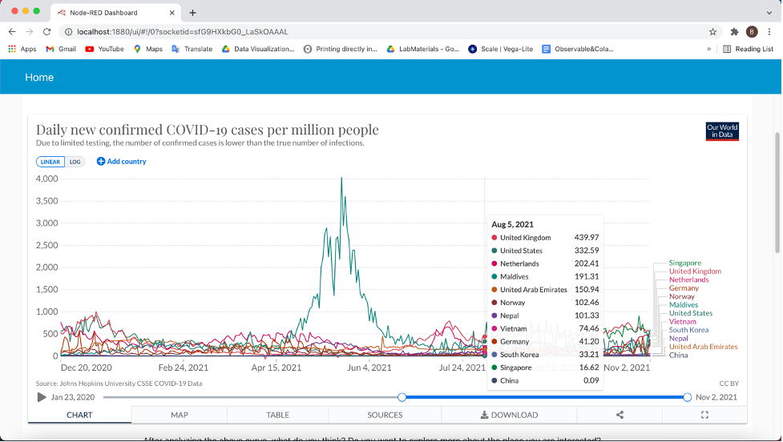
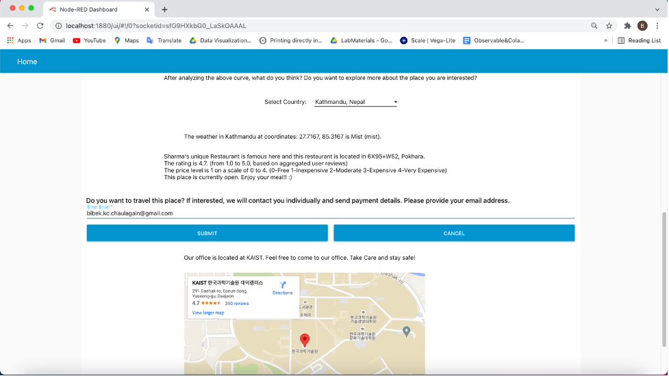
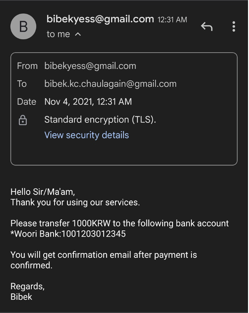
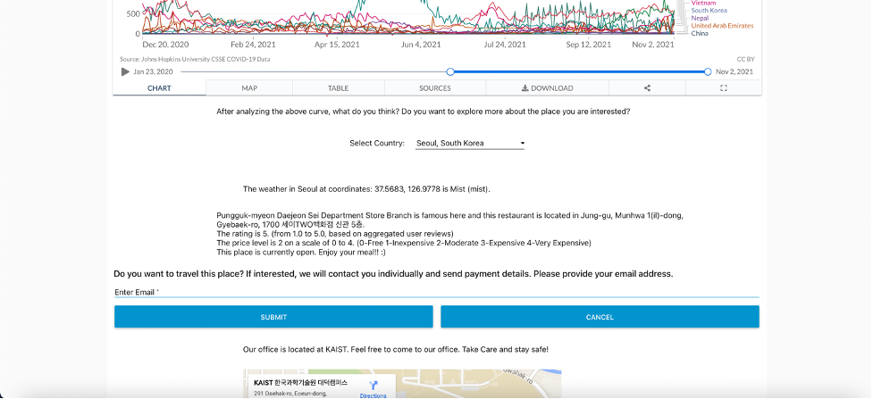

### Brief explanation about the Web services used for the mashup:

**Our World in Data COVID-19 open chart:** It shows 	the superimposed line plot of Daily new confirmed COVID-19 cases over 12 countries with respect to time (Days). It is an interactive line plot with time range-slider on the bottom with two buttons to select the interval. If the two buttons are merged, it gives the horizontal bar plot showing the cases at that day. Clicking on ‘MAP’ also shows the geographical data visualization and there are also other various ways of interacting with the graph.

**node-red-contrib-play-audio:** It converts the text to speech and plays the audio. Simply plays whatever text is in msg.payload.

**Node-red-node-email:** It sends simple emails. The topic of the email is in msg.topic. The recipient email address is in msg.to and the body of the email is in msg.payload.

**Google geocoding API:** It converts the name of the place to its respective latitude and longitude positions. The name of the place is passed in msg.location.address and it returns the latitude and longitude positions in msg.payload.lat and msg.payload.lon.

**Google Places API:** It gives the information about the place (with location coordinates) based on the given keywords. In my project, I passed in keyword as “restaurant” so it returns the location of that restaurant, price level, rating of customers and its current opening status.

**OpenWeatherMap API:** It receives the name of the city and the country code, then returns the verbal description of the current weather.

**Google Maps Embed API:** It allows to include an interactive google map on our ui dashboard. [I wanted to include the google map with the marker on the place the user selects from the dropdown box and tried a lot to achieve that but couldn’t do it.] So, here the map shows the location of KAIST, which is said to be the office of ours (service provider).

**Node-red-dashboard:** It quickly creates a live webpage without need of much html coding and provides us bunch of different nodes (like form, dropdown and much more) to make the webpage more interactive in an easy way.

*************************************************

### Explanation about the mashup application:

I have made a Travel Recommender Service. In this pandemic time, people may want to consider different factors to make a decision on where to visit and if it is a safe time now or not. So, firstly, user will have a look at the COVID-19 chart and have a look of the trend of new cases at the country of their interest. Then, if the user wants to explore more about the place like the current weather situation and inquiry of the good restaurant nearby the place, user just have to select the country from the given dropdown list. (Using Geocoding API, it converts the selected place to the location coordinates which is the input to Places API and it returns the description) Finally, if the user is interested in traveling there, he/she has to provide the email address and they will receive an auto email-message regarding payment information. Finally, if the user is nearby to our office location and want to visit us. They can make use of embedded interactive Google Map and compare their location of stay and our office and make a visit at their conveniency. Also, whenever the user selects any country, he/she hears an audio message saying: “Wow! \_\_ is beautiful.”

*****************************
### Sample Results:

The dashboard looks like this. We need to access by …/ui

Results after getting input from the user:

### References:

Hannah Ritchie, Edouard Mathieu, Lucas Rodés-Guirao, Cameron Appel, Charlie Giattino, Esteban Ortiz-Ospina, Joe Hasell, Bobbie Macdonald, Diana Beltekian and Max Roser (2020) - "Coronavirus Pandemic (COVID-19)". *Published online at OurWorldInData.org.* Retrieved from: 'https://ourworldindata.org/coronavirus' [Online Resource]

<https://developers.google.com/maps/documentation/embed/get-started?hl=en_US> [Google Maps Embed API]

Others are implemented by installing the API from ‘Manage Palette’ section of node-red and implementing it by reading their specification given on help-section of node-red.

*This project is done for one course practice project in KAIST during 2021 Fall.*
